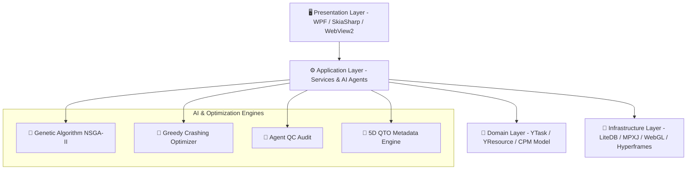

# 🏗️ YBIM TDTC Pro v0.2.1-3D — Phần Mềm Quản Lý Tiến Độ Thi Công BIM 4D/5D & Tối Ưu Hóa AI

[](https://github.com/)
[](https://dotnet.microsoft.com/)
[](https://threejs.org/)
[](https://www.buildingsmart.org/)
[](https://skiasharp.dev/)
[](De_Xuat_Gia_Ban_Phan_Mem.pdf)

> **YBIM TDTC Pro** (Time, Cost, Trade-off) là ứng dụng Desktop thế hệ mới xây dựng trên nền tảng **.NET 8 WPF Native**, kết hợp sức mạnh của **Động cơ Tiến độ CPM**, **Thuật toán Di truyền (Genetic Algorithm NSGA-II)**, **Mô phỏng Thi công BIM 4D/5D WebGL siêu tốc**, **Tiến độ Xiên Line of Balance (LOB)** và **Động cơ Xuất Video Báo cáo 4K kèm Thuyết minh Giọng nói AI (Edge-TTS)**.

---

## ⚡ Các Tính Năng Đột Phá Mới Nhất (v0.2.1-3D)

### 📈 1. Tiến Độ Xiên / Dây Chuyền SkiaSharp 60 FPS (Line of Balance - LOB)

- **Render 60 FPS siêu mượt**: Sử dụng GPU đồ họa SkiaSharp 2D trực quan hóa các đường xiên dây chuyền (Flowlines) với Trục hoành = Thời gian, Trục tung = Phân đoạn/Tầng (LBS).
- **Phát hiện đụng độ mặt bằng thi công (Location-Time Collision Detection)**: Tự động tính toán điểm cắt không gian - thời gian giữa các tổ đội thi công và vẽ cắm cờ đỏ cảnh báo đụng độ (**Crimson Red `#EF4444` Collision Marker**).


---

### 📏 2. Tự Động Hóa Bóc Tách Khối Lượng 5D QTO (`Bim5DQtoService`)

- **Metadata Parser siêu tốc**: Tự động trích xuất các thông số thể tích ($Volume - m^3$), diện tích ($Area - m^2$), chiều dài ($Length - m$) từ thuộc tính Psets trong JSON Metadata IFC 4.3.
- **Tự động liên kết Đơn giá Tài nguyên (`StandardRate`)**: Tự động nhân khối lượng 3D bóc tách được với đơn giá tiêu chuẩn trong bảng Tài nguyên dự án (`YResource.StandardRate`) để tính chi phí dự toán 5D công tác (`Cost = Quantity * UnitPrice`).

---

### 🎮 3. Động Cơ Mô Phỏng BIM 4D WebGL $O(1)$ Cached Indexing

- **Thuật toán Cached Mesh Indexing $O(1)$**: Triệt tiêu hoàn toàn giật lag lặp cây đồ họa Three.js trên từng tick timer (đã kiểm thử mượt mượt trên các mô hình lớn như `56VV-iDECO-DD-BR_GE-M3-MO_M1_TRU_T25.ifc` 13.5 MB).
- **Trực quan hóa Đường găng 4D (Critical Path)**: Tự động tô màu đỏ rực rỡ Crimson (`#EF4444`) cho các cấu kiện thuộc công tác găng đang thi công trong không gian 3D.
- **Thanh tua Timeline Scrubber & Nút Pause/Resume/Speed 1x-10x**: Cho phép kéo tua mượt mượt tiến độ bằng tay và chọn tốc độ tua mô phỏng 1x, 2x, 5x, 10x.

---

### 🔑 4. Động Cơ Cấp Phép Bản Quyền 3 Gói (Basic, Pro, Enterprise)

- **Mã hóa AES-256 6 trường thông tin**: `Email | HardwareId | ExpirationDate | Edition | MaxUsers | MaintenanceDate`.
- **Phân quyền cờ tính năng (`FeatureFlag`)**:
  - 🟢 **BASIC**: Tiến độ CPM cơ bản, Gantt 2D SkiaSharp, Nhập/Xuất Excel & Project XML, Viewer 3D GLB/IFC.
  - 🔵 **PROFESSIONAL**: Đầy đủ tính năng Basic + Tối ưu AI Di truyền GA, Tua 4D Growth Animation, 5D QTO Metadata, Tiến độ Xiên LOB, Xuất Video 4K AI Voiceover & PPTX Vector, QC Audit.
  - 🟣 **ENTERPRISE**: Đầy đủ tính năng Pro + OpenBIM IFC 4.3 WorkSchedule, REST API/SDK ERP Integration, In ấn Gantt TCVN/ISO.

---

## 🏛️ Sơ Đồ Kiến Trúc Hệ Thống (Clean Architecture)



---

## 📊 Bảng So Sánh Với Các Phần Mềm Hàng Đầu Thị Trường

| Tiêu Chí So Sánh                             | YBIM TDTC Pro v0.2.1-3D                            | Oracle Primavera P6     | MS Project Pro                                                          | Bentley Synchro 4D   | Bexel Manager             |
| :---------------------------------------------- | :------------------------------------------------- | :---------------------- | :---------------------------------------------------------------------- | :------------------- | :------------------------ |
| **Động cơ Tiến độ & CPM**           | ✅ Chuẩn CPM                                      | 🚀 Tiêu chuẩn vàng   | ✅ Tiêu chuẩn phổ thông                                             | ✅ Tích hợp 4D     | ✅ Tích hợp LOB         |
| **San bằng Tài nguyên**                | 🚀**AI Genetic Algorithm (NSGA-II)**         | ⚠️ Heuristic 1 chiều | ⚠️ Heuristic cơ bản                                                 | ⚠️ Thủ công      | ✅ Rule-based Flowline    |
| **Tối ưu Thời gian - Chi phí (TCTO)** | 🚀**Greedy Crashing & GA**                   | ❌ Không có           | ❌ Không có                                                           | ❌ Không có        | ⚠️ Giới hạn trên QTO |
| **4D BIM Rendering Engine**               | 🚀**Zero-Wait WebGL O(1)**                   | ❌ Phải dùng plugin   | ❌ Không có                                                           | 🚀 4D Advanced       | 🚀 4D/5D Data-driven      |
| **Bóc Khối Lượng 5D QTO**             | 🚀**Tự động từ IFC Psets**               | ❌ Không có           | ❌ Không có                                                           | ⚠️ Phụ thuộc P6  | 🚀 5D QTO Data-driven     |
| **Tiến Độ Xiên (Line of Balance)**    | 🚀**SkiaSharp 60 FPS + Collision**           | ❌ Không có           | ❌ Không có                                                           | ⚠️ Giới hạn      | ✅ Hỗ trợ Flowline      |
| **Báo cáo & Video Truyền thông**      | 🚀**Video 4K Hyperframes + Thuyết minh AI** | ⚠️ Tĩnh (PDF)        | ⚠️ Tĩnh (PDF)                                                        | ⚠️ Render AVI thô | ⚠️ PDF/Excel tĩnh      |
| **Chi phí & Triển khai (TCO)**          | 🚀**Portable LiteDB, 100% Offline**          | ❌ $3,000 - $5,000/năm | ⚠️ $1,000+ / user | ❌ $4,000 - $8,000/năm | ❌ $3,500 - $7,000/năm |                      |                           |

---

## 🛠️ Hướng Dẫn Đóng Gói & Phát Hành Bản Cài Đặt (Release Packaging)

Tự động biên dịch bản Release với Obfuscar bảo vệ mã nguồn 100/100, tạo bộ cài Wizard `.exe` và nén file ZIP phát hành:

```powershell
powershell -ExecutionPolicy Bypass -File .\package_release.ps1
```

**Sản phẩm kết xuất tự động tại thư mục dự án:**

- 📦 **File cài đặt Wizard (.exe):** `release_output/YBIM_TDTC_Setup_v0.2.1.exe`
- 🗂️ **File ZIP phát hành:** `YBIM_TDTC_v0.2.1.zip`

---

## 🔑 Hướng Dẫn Sử Dụng Trình Sinh Key Admin (`YBIM_KeyGen`)

1. Mở `YBIM_KeyGen.exe`
2. Nhập **Email khách hàng** và **Mã máy (Hardware ID)**
3. Lựa chọn gói bản quyền:
   - `BASIC` (Kỹ sư cá nhân - 1 máy)
   - `PROFESSIONAL` (Nhà thầu SME - Floating Users)
   - `ENTERPRISE` (Tổng thầu / Tập đoàn lớn - ERP API Integration)
4. Bấm **"TẠO LICENSE KEY 3 GÓI"** $\rightarrow$ Copy Key gửi cho khách hàng.

---

## 📚 Các Lần Cập Nhật Nâng Cấp Nổi Bật Gần Đây

- **Kết xuất Video Báo Cáo & Lọc Lũy Kế Theo Ngày (v0.2.1-3D):** Engine Hyperframes cục bộ & Thuyết minh Giọng nói AI bằng `edge-tts` dynamic duration sync qua `ffprobe`.
- **PowerPoint Slide Vector (.pptx) & S-Curve động:** Xuất bản slide dạng hình vẽ Vector và tích hợp biểu đồ Excel S-Curve nhấp đúp chỉnh sửa trực tiếp.
- **Trình mô phỏng 4D BIM Growth Animation:** Đồng bộ WebView2 + Three.js clipping plane mô phỏng thi công mọc từ dưới lên.
- **Tiện ích PowerToys-like Suite:** Tích hợp File Locksmith, Smart Paste (Ctrl+Shift+V), YBIM Awake, Presentation Mode, Shortcut Guide (F1), WBS Bulk Renamer và Gantt Ruler.

---

## 📞 Liên Hệ & Hỗ Trợ Kỹ Thuật

- **Đơn vị phát triển:** YBIM TDTC Team — Advanced Agentic Coding
- **Hotline / Zalo:** 0917.433.147
- **Tài liệu hướng dẫn:** [Huong_Dan_Su_Dung_YBIM_TDTC.md](Huong_Dan_Su_Dung_YBIM_TDTC.md)
